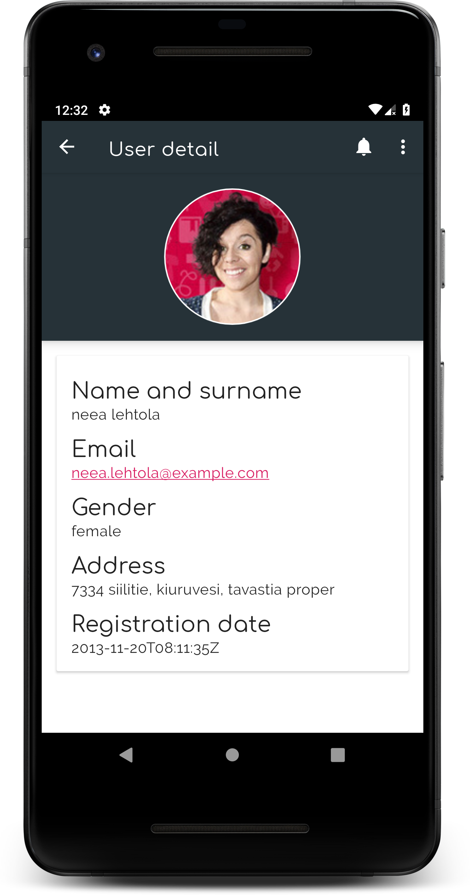
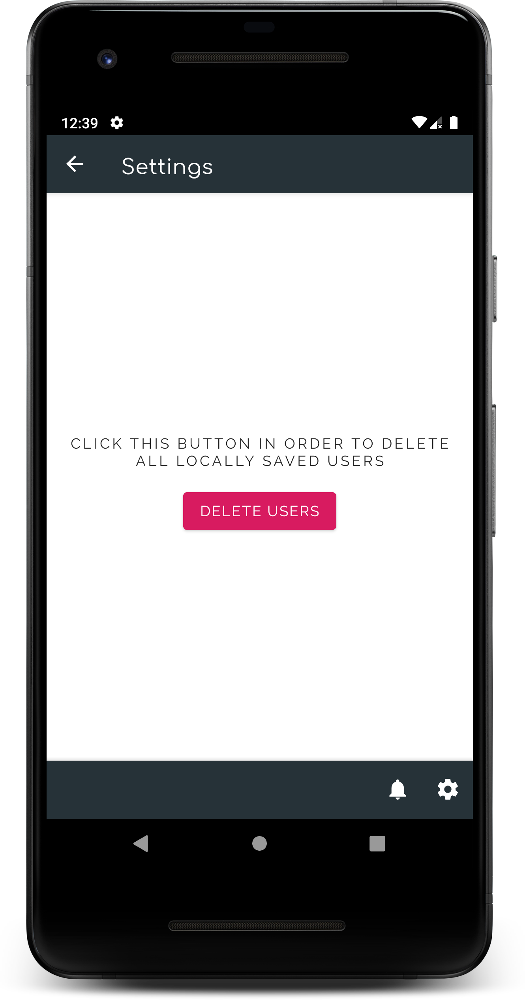

## RandomUsers

Simple project to show the use of **Android Paging Library** and **Navigation** Architecture Components, using the following:
* Clean Architecture
* Model-View-ViewModel in presentation layer
* [RxJava](https://github.com/ReactiveX/RxJava) for concurrency when calling to domain layer use cases
* [Koin](https://github.com/InsertKoinIO/koin) for dependency injection
* [Navigation](https://developer.android.com/guide/navigation) (Architecture component)
* [Android Paging Library](https://developer.android.com/topic/libraries/architecture/paging/) for pagination
* [Retrofit](https://square.github.io/retrofit/) for networking, to retrieve data from [Random user generator](https://randomuser.me/)

* * *

  