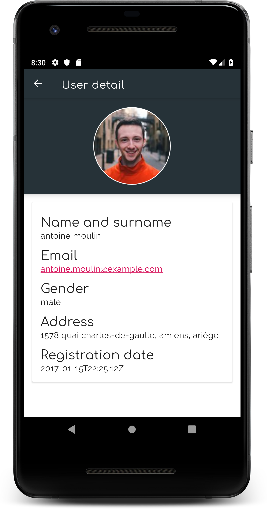

## RandomUsers

Simple project to show the use of *Paging Library* and *Navigation Architecture Components*, using the following:
* Clean Architecture
* Model-View-ViewModel in presentation layer
* Dagger 2 for dependency injection
* Navigation (Architecture component)
* Android Paging Library
* Retrofit for networking, to retrieve data from [*https://randomuser.me/*](https://randomuser.me/)

* * *

 