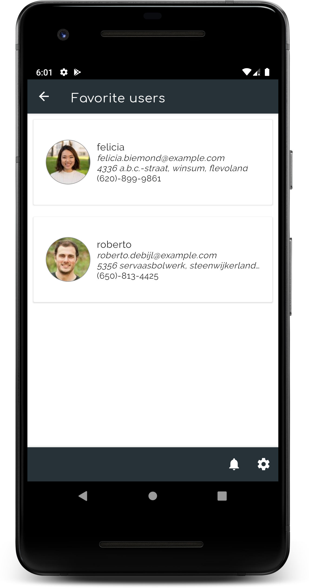

# RandomUsers

RandomUsers is a sample Android application with the main goal of show my clean architecture approach, using several Architecture Components from [Android Jetpack](https://developer.android.com/jetpack), to do the following:
* Get a paged list of random users from a paged API, save them in a local database, and show the list on screen
* Load more users on scroll
* See the user details on click
* Mark users as favorites
* Show favorite users
* *TODO: delete users on swipe, and undo the deletion*

## Architecture & libraries
I used the following architecture, patterns and libraries:
* [Clean Architecture](https://proandroiddev.com/clean-architecture-data-flow-dependency-rule-615ffdd79e29)
* [MVVM](https://proandroiddev.com/mvvm-architecture-viewmodel-and-livedata-part-1-604f50cda1) pattern in presentation layer, using [ViewModel](https://developer.android.com/topic/libraries/architecture/viewmodel?gclid=CjwKCAjwwtTmBRBqEiwA-b6c_xzTC-8dos110OOgVQtVX2pFi1lNuJ7M4ZDlZo78pG2gFcQgAYyrIRoCOLAQAvD_BwE) and [LiveData](https://developer.android.com/topic/libraries/architecture/livedata)
* [RxJava](https://github.com/ReactiveX/RxJava) for concurrency in domain and data layers
* [Koin](https://github.com/InsertKoinIO/koin) for dependency injection
* [Navigation](https://developer.android.com/guide/navigation) (Architecture component)
* [Android Paging Library](https://developer.android.com/topic/libraries/architecture/paging/) for pagination
* [Retrofit](https://square.github.io/retrofit/) for networking, to retrieve data from [Random user generator](https://randomuser.me/)
* [Room](https://developer.android.com/topic/libraries/architecture/room) for database
* [Timber](https://github.com/JakeWharton/timber) for logging
* [Glide](https://github.com/bumptech/glide) for loading images

## Screenshots

   

License
-------

    Copyright 2019 Juan José Granadilla Manzano

    Licensed under the Apache License, Version 2.0 (the "License");
    you may not use this file except in compliance with the License.
    You may obtain a copy of the License at

       http://www.apache.org/licenses/LICENSE-2.0

    Unless required by applicable law or agreed to in writing, software
    distributed under the License is distributed on an "AS IS" BASIS,
    WITHOUT WARRANTIES OR CONDITIONS OF ANY KIND, either express or implied.
    See the License for the specific language governing permissions and
    limitations under the License.
